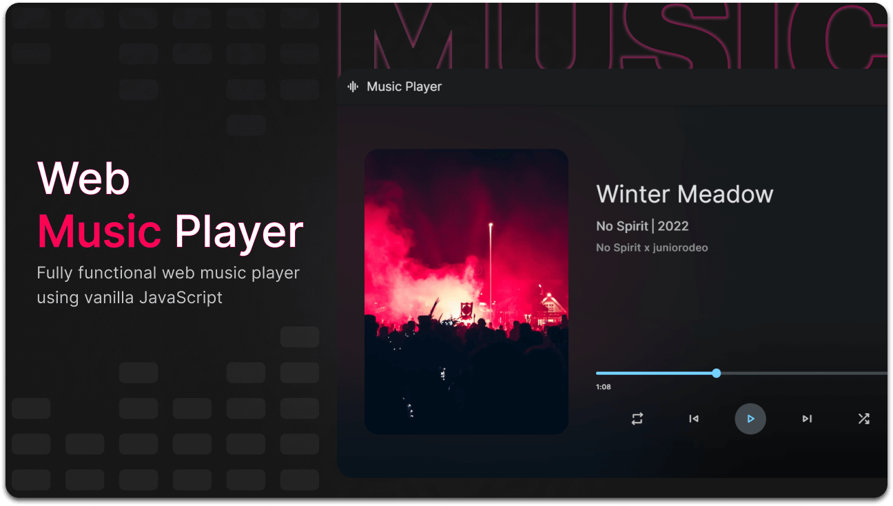

<div align="center">
  
 
  <h2 align="center">Web Music Player</h2>

  A fully responsive web music player using vanilla javascript, <br />Responsive for all devices, build using html, css, and javascript.

 

</div>

<br />

### Demo Screeshots



### Prerequisites

Before you begin, ensure you have met the following requirements:

* [Git](https://git-scm.com/downloads "Download Git") must be installed on your operating system.

### Run Locally

To run **Music Player** locally, run this command on your git bash:

Linux and macOS:

```bash
sudo git clone https://github.com/salonii78/Music-Player.git
```

Windows:

```bash
git clone https://github.com/salonii78/Music-Player.git
```


